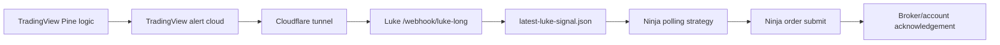
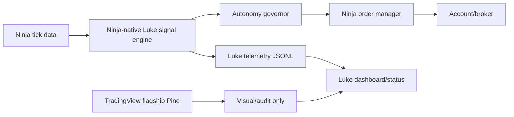

# Ninja-Native Autonomy Plan

Date: 2026-05-08

## Decision

Port the timing-critical execution path into NinjaTrader. Keep TradingView as a visual/audit cockpit and fallback alert source, not the authority for live execution timing.

Reason: current live evidence shows the slow segment is usually before Luke receives the webhook. Example: `luke-long-1778251200372-22-7413.25` was created by Pine at `2026-05-08T14:40:00.372Z`, saved by Luke at `2026-05-08T14:40:04.426Z`, and logged by Ninja at about `2026-05-08T14:40:04.562Z`. That is roughly `4054ms` from TradingView/Pine to Luke and roughly `136ms` from Luke to Ninja.

Current analyzer read from today's logs:

- `source -> Luke`: median about `3952ms`, p90 about `6203ms`, max about `8934ms` across rows where source time is inferable.
- `Luke -> Ninja`: median about `212ms`, p90 about `1715ms`, max about `3728ms` across rows with a matching Ninja log.

Interpretation: the communication path after Luke receives a webhook is usually fast enough. The edge-risk delay is the TradingView/Pine alert cloud plus any Pine-side live timing. Ninja-native execution removes that whole segment.

## Locked Boundary

The current flagship Pine file is locked. Do not modify it unless the user explicitly asks to change the flagship Pine. The migration work should live in NinjaTrader, Luke diagnostics, tests, docs, and optional non-production ports.

## Current Chain



## Bottleneck Tests

| Segment | Measurement | If slow | Fix |
| --- | --- | --- | --- |
| Pine/TradingView to Luke | `source_to_luke_ms` in `state/events/ninjatrader-bridge.jsonl` | TradingView alert delivery or Pine alert timing is late | Move signal authority into Ninja |
| Luke to Ninja | `luke_to_ninja_ms` from bridge event to Ninja `LUKE SIM LONG` log | File polling or local IO is late | Lower poll interval, named pipe/socket, or direct Ninja add-on |
| Ninja order submit | Ninja `LUKE SIM LONG` to order `Submitted/Working` log | Ninja/broker handling is late | Preloaded ATM/bracket path or managed-order optimization |
| Fill timing | `Working/Filled/Cancelled` order logs | Limit order is waiting, not communication-late | Tune execution model, not transport |
| Feed mismatch | TradingView signal price vs Ninja tick price | Two feeds disagree | Ninja-native signal engine with one execution feed |

## Recommended Architecture



## Ninja-Native Components

1. `LukeNativeSignalEngine`

   Owns the strategy state machine currently expressed in Pine: level parsing, cluster selection, reclaim/flush detection, watch/armed/long/cancel states, stop/TP geometry, and realistic accounting.

2. `LukeLevelSource`

   Loads Mancini, Saty, and Luke levels from files written by Luke. This replaces manually pasting levels into Pine as the execution source. TradingView can still display the same levels.

3. `LukeMultiFrameState`

   Uses Ninja `OnEachTick` plus 1m/3m/5m data series to reproduce the Pine LTF validation without waiting on TradingView alert cadence.

4. `LukeAutonomyGovernor`

   Modes:
   - `Disabled`: observe only.
   - `Shadow`: calculate signals, write telemetry, no orders.
   - `Sim`: place simulated orders only.
   - `LiveGuarded`: live account allowed only with exact account, max quantity, max session loss, flat-position checks, news pause, and manual enable.

5. `LukeOrderManager`

   Owns limit-at-entry orders, split TP1/TP2 runner, stop placement, breakeven move, cancel handling, expiry, and account-safe re-entry rules.

6. `LukeTelemetryWriter`

   Writes `state/events/ninja-native-signals.jsonl` with tick time, signal time, order submit time, order state changes, fill/cancel outcomes, and reason codes.

## Porting Protocol

1. Freeze Pine behavior as the reference.

   Do not improve the edge during the port. Copy behavior, names, and math first.

2. Build a C# native strategy with shadow as the default mode.

   It computes `WATCH`, `ARMED`, `LONG`, and `CANCEL` from Ninja ticks and writes telemetry. Order submission remains off unless the operator selects `SimExecution` or `LiveGuarded`.

3. Run parity tests.

   Compare Ninja shadow events against TradingView/Pine events for the same session: level, entry, stop, TP1, TP2, class, timing, and cancellation.

4. Enable sim-only execution.

   Use the same order manager already proven by the bridge, but fed by native Ninja signals instead of webhook files.

5. Run side-by-side production observation.

   TradingView stays open as visual/audit. Ninja-native runs shadow or sim. Compare missed signals, delay, fill quality, and cancel timing.

6. Promote to guarded live.

   Only after shadow/sim parity is acceptable and the latency report proves the TradingView cloud is the dominant delay.

## Implementation Choice

Implement next: Ninja-native shadow strategy plus telemetry, not more Pine transport patching.

The current bridge should stay as a fallback and test harness. The edge-sensitive path should move to Ninja because Ninja has the execution feed, tick cadence, order manager, and broker/account context in one runtime.

## Current Implementation

Created:

- `ninjatrader/LukeNativeShadowStrategy.cs`
- `lib/ninja-native-telemetry.js`
- `scripts/analyze-ninja-native-telemetry.js`
- `scripts/check-ninja-native-port.js`
- `scripts/install-ninja-native-shadow.js`
- `scripts/export-ninja-native-levels.js`
- `tests/ninja-native-source.test.js`
- `tests/ninja-native-telemetry.test.js`
- `tests/ninja-native-install.test.js`
- `tests/ninja-native-level-export.test.js`

The Ninja strategy defaults to shadow and now has guarded native execution modes. The source gate still bans unmanaged submit and short-side order calls, but allows the managed LONG limit/bracket calls only behind `NativeExecutionEnabled()`, account guards, flat-position checks, and the entry-price wiggle gate.

The port now covers:

- tick-driven Ninja calculation via `Calculate.OnEachTick`
- 1m and 3m secondary series for LTF validation
- internal Saty generation from the chart instrument daily series using Pine `close[1]` plus ATR(14)[1]
- external Mancini level-file parsing and clustering
- WATCH / ARMED / BLOCKED / INVALIDATED / LONG / CANCEL telemetry
- Pine-style entry, stop, TP1, TP2 geometry defaults
- pivot-ribbon filter defaults aligned to the existing replay engine
- same-bar live cancel when a pending LONG no longer qualifies
- post-entry shadow outcome tracking for TP1, TP2, stop-first, TP1-then-stop, and mixed-bar conservative stop
- Pine-style bar-edge state, live-cancel semantics, split-contract accounting, slippage cost, and commission telemetry
- guarded native LONG execution using limit-at-entry, split TP1/TP2 brackets, cancel/expiry handling, and runner breakeven after TP1
- stale/chase blocking when Ninja's current price is more than `0.25` points away from the Pine-style entry

Current proof commands:

```powershell
npm run ninja:native:check
npm run ninja:native:install:dry
npm run ninja:native:levels
npm run ninja:native:telemetry
npm run ninja:bridge:latency
npx vitest run tests/ninjatrader-alert-bridge.test.js tests/ninja-bridge-latency.test.js tests/ninja-native-telemetry.test.js tests/ninja-native-source.test.js tests/ninja-native-install.test.js tests/ninja-native-level-export.test.js
node scripts/backtest-saty-pine-watch.js --start 2026-04-20 --end 2026-04-29 --out-dir artifacts/research/ninja-native-port-parity --entry-slippage-points 0.25 --round-trip-fee 5
```

NinjaScript Editor compile status: user confirmed an earlier installed `LukeNativeShadowStrategy` compiled on 2026-05-08. After the guarded execution update, run a fresh NinjaScript Editor compile before live use.

Repo-side C# compile check: `csc.exe` compiled `ninjatrader/LukeNativeShadowStrategy.cs` against `NinjaTrader.Core.dll`, `NinjaTrader.Gui.dll`, and the installed `NinjaTrader.Custom.dll` with warnings only from the previously installed type definitions. The updated source was copied into `C:\Users\conor\OneDrive\Documents\NinjaTrader 8\bin\Custom\Strategies\LukeNativeShadowStrategy.cs` and the installer dry-run confirmed `target_same=true`. Full NinjaScript Editor compile still needs to be run inside NinjaTrader after this latest install.

Latest local replay proof against the existing Pine-style replay engine:

- local bars: `58,799`
- sessions tested: `8`
- current Pine/Saty close-reference variant using the locked Pine default `2ES split` accounting: `228` trades, `195.70` raw points, `$4,920.00` net after slippage cost plus commission, `17.1%` stop-first
- comparison open-reference variant using the same split accounting: `242` trades, `210.00` raw points, `$5,722.50` net after slippage cost plus commission, `12.4%` stop-first

The earlier `$11,820.00` replay number was not valid as Pine-default dollar proof because the local oracle was still effectively scoring a single-contract path. That number has been replaced by split-contract accounting that matches the locked Pine defaults: `2ES split`, entry-only `0.25` slippage cost, and `$5.00` round-trip commission per contract.

The replay proof is still a local historical replay, not a live Ninja execution report. The next proof is a side-by-side Ninja shadow run that compares Ninja-native telemetry timestamps against the locked Pine's LONG/CANCEL marks on the same ES chart.
