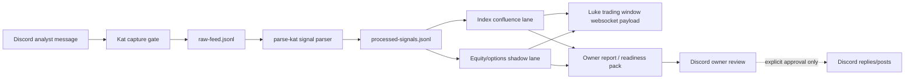
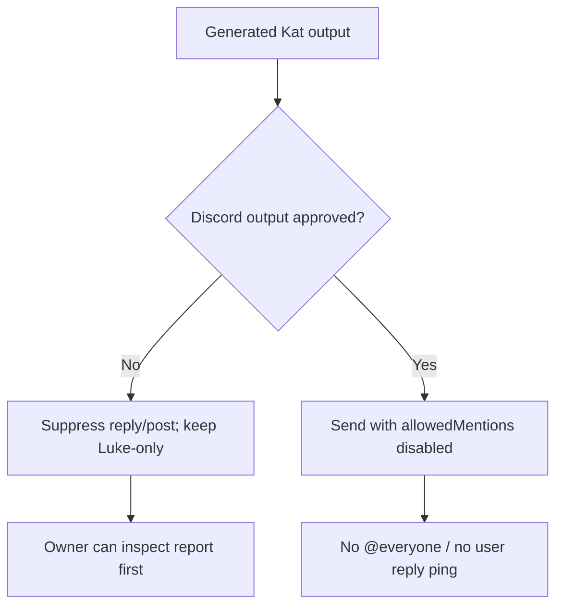

# Katbot Owner Review Pack

Status: **owner_review_ready**

Ready for owner review as silent capture and Luke-only shadow evidence, not public Discord answering.

> Discord replies/posts are gated off in this build. Nothing here has been sent to Discord.

## Pipeline


## Safety Gate


## Current Evidence
- Raw messages captured: 12255
- Processed signals: 2604
- Heatmap/image candidates: 700
- SPX/SPY evaluated records: 114
- Shadow watchlist: TSLA, CAR, AAOI, MU, SNDK, LITE, ASML, ARM, COST, MSFT
- Ready for downstream validation: MU, LITE, ASML

## Parsed Message Proof: Index Lane
- Analyst: mathemeatloaf7
- Channel: ☔︱spy-qqq-es-nq-vix
- Message ID: 1498724694176694443
- Timestamp: 2026-04-28T16:36:52.050Z
- Message: "$spy if peaking at this TL resistance next target would be 698-690 below 690 can start opening the door to the large gap below at 660 imo"
- Parsed ticker: SPY
- Parsed bias: BEARISH
- Parsed levels: 698, 690, 660

```json
{
  "signal_type": "CHART_ANALYSIS",
  "ticker": "SPY",
  "timeframe": null,
  "bias": "BEARISH",
  "pattern": "resistance",
  "levels": [
    698,
    690,
    660
  ],
  "has_image": true,
  "raw": "$spy\n\nif peaking at this TL resistance\n\nnext target would be 698-690\n\nbelow 690 can start opening the door to the large gap below at 660 imo",
  "analyst": "mathemeatloaf7",
  "ts": "2026-04-28T16:36:52.050Z",
  "message_id": "1498724694176694443",
  "channel": "☔︱spy-qqq-es-nq-vix",
  "user_id": "755259514068009041"
}
```

## Parsed Message Proof: Equity/Options Shadow Lane
- Analyst: kaprik0rn3
- Channel: 🟢︱trade-floor
- Message ID: 1496891939268722860
- Timestamp: 2026-04-23T15:14:09.229Z
- Message: "MU 10min. Almost 3% move off LOD"
- Parsed ticker: MU
- Asset class: equity

```json
{
  "asset_class": "equity",
  "underlying": "MU",
  "side": null,
  "strike": null,
  "expiry": null,
  "premium": null,
  "confidence": "low",
  "parse_note": "Equity shadow context only; needs market data and scoring before recommendations."
}
```

## Image Proof Candidate
- Analyst: mathemeatloaf7
- Channel: 🟢︱trade-floor
- Message ID: 1500171801278550036
- Timestamp: 2026-05-02T16:27:09.269Z
- Message: "$zs weekly chart just reclaimed this 6 year old TL. this setup has only 3 full weeks to play out before ER week key is to reclaim 140.56. doing so shoudl start setting up a squeeze to 160-165 im eyeing 5/22 far otm calls next week"
- Attachment URL: https://cdn.discordapp.com/attachments/1040400353490911292/1500171801001721876/image.png?ex=69f8201d&is=69f6ce9d&hm=74aa2499a427901a017de46d195f88b7fcb3d5f221d5c368d1d0d87d5bfe0956&

## Rendered Screenshot Proof
- Owner proof page: `screenshots/owner-proof.png`
- Luke trading-window preview: `screenshots/luke-trading-preview.png`

## Timestamped Message Bin
- Examples JSON: `message-bin/katbot-message-examples.json`
- Examples Markdown: `message-bin/katbot-message-examples.md`
- Examples HTML: `message-bin/katbot-message-examples.html`
- Suppressed Discord output sink: `message-bin/katbot-output-bin.jsonl`

## Discord Preview
Preview only. This is how owner-facing Kat output would look if explicitly approved later.

```text
**Kat owner-review preview**
Status: owner_review_ready
Evidence: 12255 raw messages, 2604 processed signals
Watchlist: TSLA, CAR, AAOI, MU, SNDK, LITE
Discord output: gated off until Conor explicitly approves generated wording.
_No autonomous execution. Human-gated evidence only._
```

## Luke Trading Window Preview
Separate operator-facing view. This is what Luke receives internally.

```json
[
  {
    "type": "kat_signal",
    "source": "katbot-discord",
    "ticker": "SPY",
    "bias": "BEARISH",
    "levels": [
      698,
      690,
      660
    ],
    "analyst": "mathemeatloaf7",
    "channel": "☔︱spy-qqq-es-nq-vix",
    "message_id": "1498724694176694443",
    "human_gate_required": true
  },
  {
    "type": "kat_watchlist_signal",
    "source": "katbot-discord",
    "ticker": "MU",
    "asset_class": "equity",
    "option_context": null,
    "equity_context": {
      "asset_class": "equity",
      "underlying": "MU",
      "side": null,
      "strike": null,
      "expiry": null,
      "premium": null,
      "confidence": "low",
      "parse_note": "Equity shadow context only; needs market data and scoring before recommendations."
    },
    "analyst": "kaprik0rn3",
    "message_id": "1496891939268722860",
    "policy": "equity/options shadow-watch only; not SPX-equivalent and not execution authority",
    "human_gate_required": true
  }
]
```

## Readiness Details
# Katbot Readiness

Recommendation: owner_review_ready
Ready for owner review as silent capture and Luke-only shadow evidence, not public Discord answering.

## Evidence
- Raw messages: 12255
- Processed signals: 2604
- Heatmap candidates: 700
- Replay records: 1078
- SPX/SPY evaluated: 114
- Watchlist: TSLA, CAR, AAOI, MU, SNDK, LITE, ASML, ARM, COST, MSFT
- Ready for downstream validation: MU, LITE, ASML

## Blockers
- none

## Warnings
- SPX/SPY sample size: 114 evaluated direct records

## Owner Notes
- Discord outputs still gated: replies=false, posts=false
- Recommend silent capture and Luke-only shadow evidence before any public Discord answering.
- Do not enable Discord replies or channel posts until Conor explicitly approves generated wording.
- No autonomous execution exists here; all outputs remain human-gated evidence.
- Backtesting/scoring remains owned by the separate backtesting lane.
